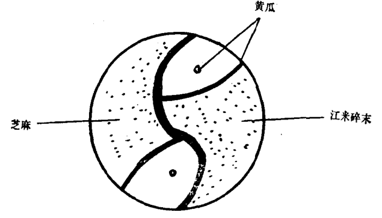

# 炸鸳鸯虾托

## 杨永和版本

 

### 原料

主料：青虾仁（或大虾肉）四两。  

配料：鸡蛋二个，精白面包六两，芝麻五钱，碎江米五钱，黄瓜少许（用皮）。  

调料：熟花生油二斤（做炸料用，约耗一两五钱），精盐三分，味精二分，绍酒一钱，鲜姜五分，淀粉三钱。  

### 操作过程 
 
1. 青虾仁用清水洗净，用干净白布撮去水，剁成细泥，放在一个碗内；姜洗净去皮切成极细的细末，也放入虾泥碗内；加精盐、味精、绍酒、鸡蛋（一个）、淀粉，搅拌均匀。黄瓜皮切成细条备用。面包片去外皮，切成直径一寸四分、厚三分的圆片二十片。鸡蛋（一个）磕了打匀，抹在每一片面包的一个大面上，取虾泥抹在面包上，做成阴阳鱼形状（见下图），用黄瓜条做鱼鳃和鱼的眼睛，一尾鱼的身上撒上芝麻（鱼鳞），另一尾鱼的身上撒上事先泡好的江米碎末（鱼鳞），待全部做完后，用手拍实。  

2. 把炒勺放在旺火上，倒入花生油，烧至六成热时，把虾托逐个放入，注意火不要过急，炸透后倒在漏勺内，滤去油，码在盘内即成。  

### 特点

色泽金黄，肉质鲜嫩，面包酥脆，两条鱼横卧在一起，阴阳相对，图案美丽。  

