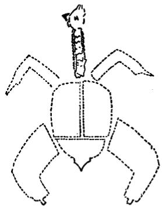

# 笋鸡炸八块

## 杨永和版本

 

### 原料

主料：宰好的笋鸡一只（约重一斤）。  

调料：熟花生油一斤（做炸料用，约耗一两二钱），精盐二钱，花椒数粒。  

### 操作过程 
 

1. 笋鸡剁去爪，用刀在鸡嗦子处划一口，取出气管和嗦子，  

仰放在菜案上，在肛门稍上侧处（软肚皮处）横开一口，取出内脏，用清水冲洗干净，共切成八块，即脖子和头一块，两个翅膀两块，两条大腿和脊骨后少半部连鸡尖共切三块，鸡脯和脊背前多半部切成两块，用煮酱牛肉的汤（见第275页酱牛肉的制做方法），将鸡块煮成八成熟。  

2. 把炒勺放在旺火上，倒入花生油，待油烧至七成热时，放入鸡块炸成金黄色，约炸三分钟，倒在漏勺内，滤去油，按鸡形码放在盘内（如上页插图所示），蘸椒盐吃。  

  
### 特点

色泽金黄，外焦里嫩，鲜香适口。  

