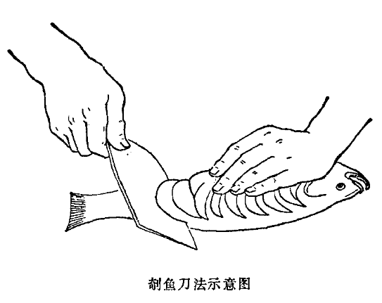

## 北京饭店版本

 

### 原料   

1. 主料：腹部开膛活鲤鱼1尾（3斤以内）。  

2. 配料：川冬菜1两，猪肥瘦肉5两，小白菜五两，面粉3两。  

3. 调料：葱、姜、盐、味精、胡椒面、椒盐、鸡蛋、干淀粉、水淀粉、花生油、酱油、白糖、料酒。  

### 操作过程   

1. 鱼剁去胸、腹、脊的鳍，在鱼身两侧横剖坡刀（见图），用葱（拍破）、姜（拍破）、盐、料酒、胡椒面抹匀腌上。冬菜洗净切碎。猪肉二两切成丝，三两切成绿豆大小的丁。小白菜用开水烫熟，捞在凉水内透凉，挤去水分剁碎。面粉用开水和成面团。葱切少许葱花。姜切少许末。鸡蛋一个去黄用青，兑干淀粉调成稀糊。  

2. 烧热锅注入一两油，油沸时，下入肉丝、葱花、姜末炒熟，加料酒、酱油、糖炒匀，再加进冬菜炒匀，倒出晾凉。  

3. 锅烧热注入一两油，油沸时下入肉丁、葱、姜末炒熟，加料酒、酱油、白糖、味精炒匀，倒出晾凉，加小白菜拌匀成馅。将面团揪成十二个剂，擀成圆薄片，包成饺子，上笼蒸熟。  

4. 在蒸饺的同时，烧沸油，手提鱼尾，在鱼身上挂上水淀粉，再滚上干淀粉，把冬菜肉丝装入腹内，用蛋青糊把开口处粘上，将鱼下入油锅，下面用锅铲垫上（以免巴锅）待一面炸到收缩时，翻身再炸，等到两面都炸呈黄脆时，捞出盛在盘内。及时取出蒸饺镶在两侧，随两小碟椒盐上席。  

### 特点  

色泽深黄，质地脆嫩，具有冬菜香味，为宴会菜之一。  

注：其他皖、鲟、鳜鱼均可制作。  

